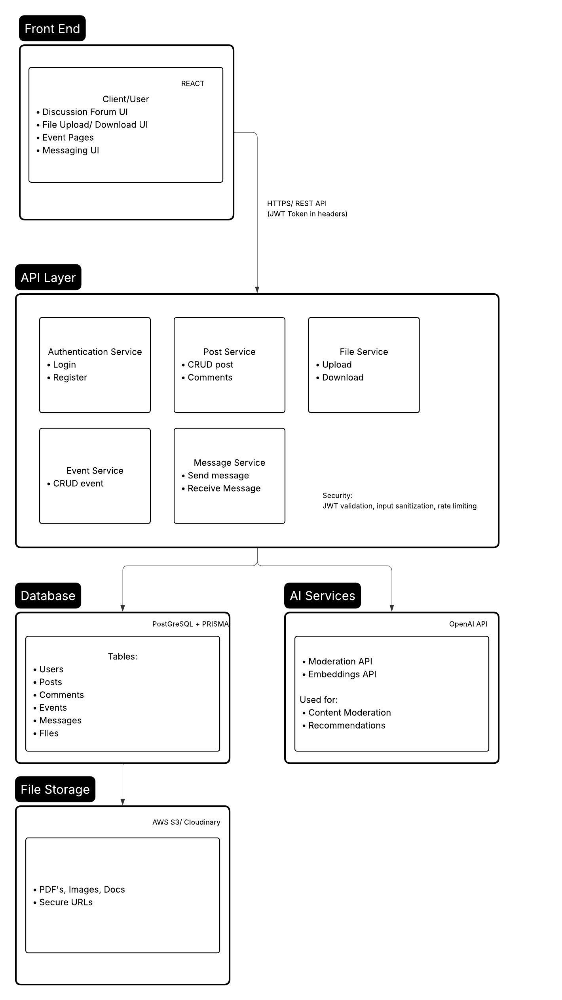

5. System Architecture
5.1.

5.2.
1. Frontend <-> API <-> Database Interaction
The frontend is constructed using the Next.js and it runs in the user's browser, which is students. Those students will interact with the features such as forums, chat, file sharing, and event scheduling through the web interface. All of the user actions will be recorded and sent to the backend, using the RESTful API over HTTPS.

The backend, which is API will be implemented using Node.js and Next.js API routes. It will handles the authentication, authorization, business logic, and validation. And after validating the requests, the API will communicate with the PostgreSQL database through Prisma ORM to store and retrieve the user's data, posts, messages, and collaboration files.

Moreover, for the AI-related features such as content moderation and discussion summarization, the backend forwards relevant text data to the AI services and processes the returned results before sending them to the frontend. File uploads are stored in cloud storage and referenced in the database.

2. Separations of Concerns
The system follows a layered architecture to ensure separation of responsibilities : 
- Frontend : User interface rendering, client-side validation, and user interaction
- Backend : Authentication, authorization, business rules, AI integration, and API routing
- Database Layer : Persistent storage and data integrity

The AI processing, file storage, and caching services are separated from the main API logic to improve scalability and maintainability. This will allows each component to be developed, tested, and deployed independently, which will improves the system reliability and code quality.

3. Where security is enforced
The security is mainly enforced on the backend API layer. All of the requests have to be authenticated using the JWT (JSON Web Tokens) before accessing the protected resources. The role-based authorization is implemented to distinguish between regular users and moderators.

All communication between client and server uses HTTPS to prevent data interception. Input validation and output sanitization are applied to prevent XSS and injection attacks. Database queries are executed through Prisma ORM to avoid SQL injection.

Uploaded files are validated for type and size before storage. Sensitive credentials such as database passwords and API keys are stored using environment variables. Logging and monitoring are implemented to track suspicious activities and moderation actions.