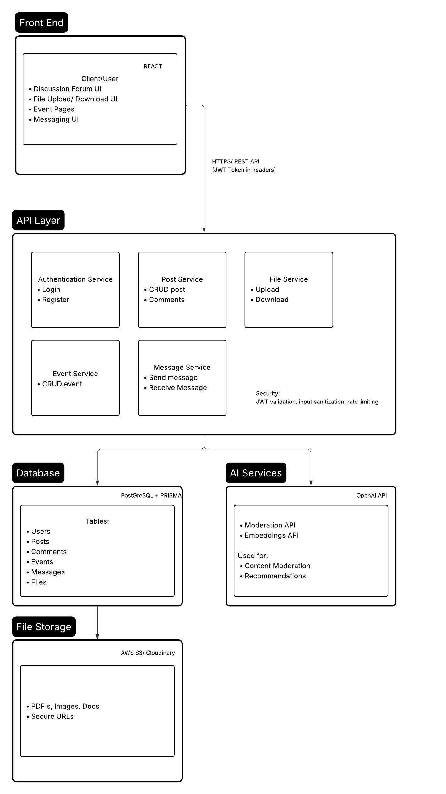

# 1. Project Information

Project Title:
Academify

Project Domain:
Student Community & Collaboration Platform

Class:
COMP6703001 - L4AC

Group Members:
|            Name              |  StudentID   |   Role  |GitHub Name|
|------------------------------|:------------:|:-------:|----------:|
| Vickelsteins August Santoso  | 2802505941   | Coding  | Vickel317 |
| Harris Ekaputra Suryadi      | 2802400502   | Coding  | HES2209   |
| Kevin Makmur Kurniawan       | 2802547553   | Coding  | kevMkr    |

# 2. Instructor & Repository Access

This repository is shared with:

• Instructor: Ida Bagus Kerthyayana Manuaba

o Email: imanuaba@binus.edu

o GitHub: bagzcode

• Instructor Assistant: Juwono

o Email: juwono@binus.edu

o GitHub: Juwono136

# 3. Project Overview

## 3.1. Problem Statement

Students usually have trouble to find an environment that supports collaboration. Some of them are incompatible or require payment to collaborate with each other, which can be hard for student. Most websites or application only supports 1 or 2 kinds of files to collaborate with. Thus, this web application is targeting people with an academic background that has an interest in sharing their projects, collaborating, and also accessing more information from other sources, which is from other experienced academic people. Allowing people to collaborate with various file types without changing or moving to another website or web application. The target users would be any student that looks for academic collaboration, student moderator to maintain community standard, and admin to maintain the system. 

## 3.2 Solution Overview

### **Main Features**

Our web application provides an AI powered academic social platform designed to connect students. This platform have some features such as:

#### 1. Discussion Forums
- Create discussion threads with title, content, and category selection
- View list of all threads filtered by  topics
- Add and delete threads
- Basic search by thread title

#### 2. Secure File Sharing
- Upload files in discussion thread (PDF,PNG, JPG, JPEG, DOCX)
- Download files from threads
- File type and size validation for security

#### 3. Event & Study Session Scheduling
- Create events with title, description, date/time, and location
- View list of upcoming events sorted by date
- View detailed event information

#### 4. User Profiles & Authentication
- User registration with email, username, password, major, and bio
- Secure login/logout with Better Auth (session cookies)

#### 5. Asynchronous Messaging System
- Send direct messages to other users
- Reply to messages
- View inbox showing sender, message preview, and timestamp

#### 6. Role-Based Access Control
- Three user roles: Student (default), Moderator, Admin
- Students: Can create and manage their own content
- Moderators: Can delete any post, review flagged content, manage community
- Admins: Full platform access, can appoint moderators, manage users

### **Why this solution is appropriate**

This platform helps students by solving their collaboration challenges via:
- Centralizing communication: Replacing fragmented tools with one unified platform for discussion
- Ensuring Safety: AI-powered content moderation is used to maintain a respectful and spam free environment
- Facilitating Discovery: Smart topic recommendations and organized categories help students find relevant discussions and study partners effortlessly

### **Where AI is Used**

AI functionality is integrated to enchance user experience. AI features that can be expected are:

#### 1. AI-Powered Content Moderation
- Purpose: To automatically detect and flag inappropriate content, spam, harassment, and policy violations in real-time
- Implementation: Uses OpenAI Moderation API to analyze all posts, comments, and messages before publication
- Technology: OpenAI Moderation API with custom threshold configuration
- Impact: Maintains a safe, respectful academic environment 24/7 without requiring constant human moderator presence

#### 2. Smart topic recommendation
- Purpose: To personalize the user's feed with topics and discussions that match their academic interests and engagement patterns
- Implementation: Uses OpenAI Embeddings API to analyze semantic similarity between user interests and available discussion threads, then ranks and displays the most relevant content
- Technology: OpenAI Embeddings API (text-embedding-3-small model) with cosine similarity matching
- Impact: Reduces information overload by surfacing relevant academic discussions automatically, helping students discover study groups, course-related threads, and topics aligned with their major without manual searching

# 4. Technology Stack

| Layer | Technology |
| :------ | :----------- |
| Frontend | Next.js |
| Backend | Node.js or Next.js |
| API | REST API |
| Database |PostgreSQL/Firebase |
| Containerization |Docker |
| Deployment | Cloudflare |
| Version Control | Github |

# 5. System Architecture
## 5.1. Architecture Diagram

## 5.2. Architecture Explanation
#### 1. Frontend <-> API <-> Database Interaction

The frontend is constructed using the Next.js and it runs in the user's browser, which is students. Those students will interact with the features such as forums, chat, file sharing, and event scheduling through the web interface. All of the user actions will be recorded and sent to the backend, using the RESTful API over HTTPS.

The backend, which is API will be implemented using Node.js and Next.js API routes. It will handles the authentication, authorization, business logic, and validation. And after validating the requests, the API will communicate with the PostgreSQL database through Prisma ORM to store and retrieve the user's data, posts, messages, and collaboration files.

Moreover, for the AI-related features such as content moderation and discussion summarization, the backend forwards relevant text data to the AI services and processes the returned results before sending them to the frontend. File uploads are stored in cloud storage and referenced in the database.

#### 2. Separations of Concerns

The system follows a layered architecture to ensure separation of responsibilities : 
- Frontend : User interface rendering, client-side validation, and user interaction
- Backend : Authentication, authorization, business rules, AI integration, and API routing
- Database Layer : Persistent storage and data integrity

The AI processing, file storage, and caching services are separated from the main API logic to improve scalability and maintainability. This will allows each component to be developed, tested, and deployed independently, which will improves the system reliability and code quality.

#### 3. Where security is enforced

Security is enforced across multiple layers:

- **Backend API**: All protected routes require a valid Better Auth session. Role-based authorization distinguishes students, moderators, and admins.
- **Input validation & sanitization**: Shared validators on API bodies; `sanitizeText()` on messages, posts, and comments; Prisma ORM prevents SQL injection.
- **File uploads**: MIME allowlist, size caps, and dangerous filename blocking. Virus/malware scanning is **not** implemented (documented limitation).
- **Moderation**: AI-driven text moderation with profanity fallback; banned/suspended users blocked from posting and messaging.
- **Rate limiting**: Global IP-based limits on all `/api/*` routes; per-user cooldown on AI routes.
- **Transport & headers**: HTTPS in production; security headers (HSTS, CSP, X-Frame-Options, etc.) via `proxy.ts`.
- **Real-time socket server**: `/emit-notification` requires a shared secret; socket server should run on an internal network.

# Appendix B — Security & Testing Reference

## B.1 Live Application URL

| Environment | URL |
|-------------|-----|
| Production | https://e2526-wads-b4ac-02.csbihub.id |
| Local development | http://localhost:3000 |

## B.2 Security Feature Matrix

| Area | Implementation | Status |
|------|----------------|--------|
| Auth & sessions | Better Auth, HTTP-only cookies, `Secure` in production | Implemented |
| CSRF mitigation | `SameSite=Lax` session cookies; same-origin API calls | Implemented |
| RBAC | Role checks on admin, moderation, post, and file routes | Implemented + tested |
| Forum creation | Restricted to lecturers and admins (`canCreateForum`) | Implemented |
| Input validation | Shared validators + Prisma ORM | Implemented |
| XSS sanitization | `sanitizeText()` on messages, posts, and comments | Implemented + tested |
| File uploads | MIME allowlist, size cap, filename validation | Implemented |
| Virus/malware scan | Not integrated (ClamAV not deployed) | **Known limitation** |
| Image moderation | Text-only AI moderation; images not scanned | **Known limitation** |
| Text moderation | AI + profanity fallback; restricted users blocked | Implemented |
| AI abuse control | Per-user cooldown on summarize/recommend routes | Implemented + tested |
| Global rate limiting | IP-based limits on all `/api/*` routes via `proxy.ts` | Implemented + tested |
| Socket emit auth | Shared secret on `/emit-notification` | Implemented |
| Security headers | HSTS, CSP, X-Frame-Options, nosniff on pages + API | Implemented |

## B.3 Security Test Coverage

| Test file | What it verifies |
|-----------|------------------|
| `security-critical.test.ts` | Dangerous filenames, message/post/comment XSS sanitization, restricted users |
| `api-authorization.test.ts` | RBAC on admin, posts, moderation routes |
| `files-authorization.test.ts` | File access authorization |
| `categories-authorization.test.ts` | Forum creation restricted to lecturers/admins |
| `ai-rate-limit.test.ts` | AI route per-user cooldown |
| `rate-limit.test.ts` | Global API rate limit presets |
| `ai-moderation.test.ts` | AI moderation pipeline |

## B.4 AI Security Scenarios

| Scenario | Expected behavior | Test coverage |
|----------|-------------------|---------------|
| Prompt injection in post content | Content sent to moderation model; flagged content enters moderation queue | Manual / `ai-moderation.test.ts` |
| AI service unavailable | Profanity fallback flags obvious violations; posts remain in PENDING until reviewed | `ai-moderation.test.ts` |
| AI rate abuse | Per-user cooldown returns `429 RATE_LIMITED` | `ai-rate-limit.test.ts` |
| Restricted user posting | Banned/suspended users receive `403` on posts, messages, comments | `security-critical.test.ts` |

## B.5 AI Usage Disclosure

| Feature | Model / Service | Data sent | Purpose |
|---------|-----------------|-----------|---------|
| Content moderation | Ollama (local LLM) | Post title + body text | Flag policy violations before publication |
| Thread summarization | Ollama (local LLM) | Approved post + comments | Generate summary for readers |
| Topic recommendation | Ollama (local LLM) + heuristics | User interests + forum metadata | Suggest relevant forums |

No user passwords, session tokens, or private messages are sent to external AI services. AI features run against a locally hosted Ollama instance configured via environment variables.

## B.6 Environment Variables (Security-Related)

| Variable | Purpose |
|----------|---------|
| `BETTER_AUTH_SECRET` | Better Auth encryption/signing secret |
| `SOCKET_EMIT_SECRET` | Shared secret for socket `/emit-notification` |
| `RATE_LIMIT_*` | Optional overrides for global API rate limits |
| `AI_RATE_LIMIT_MS` | Per-user AI route cooldown (default 15000 ms) |